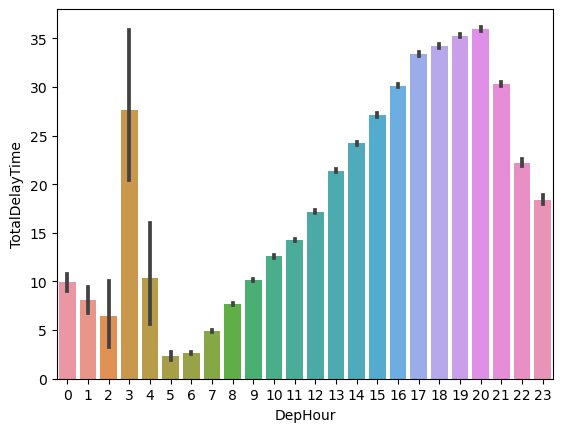
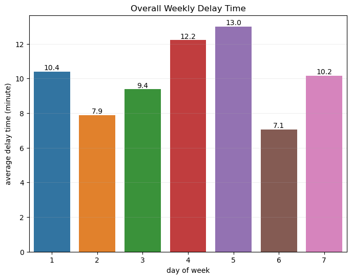
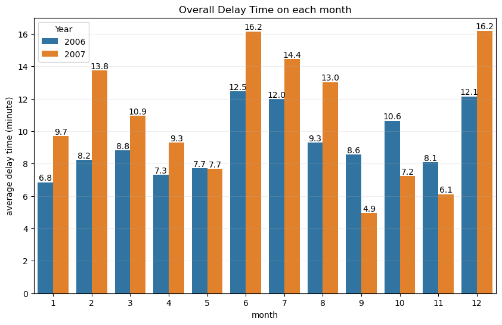
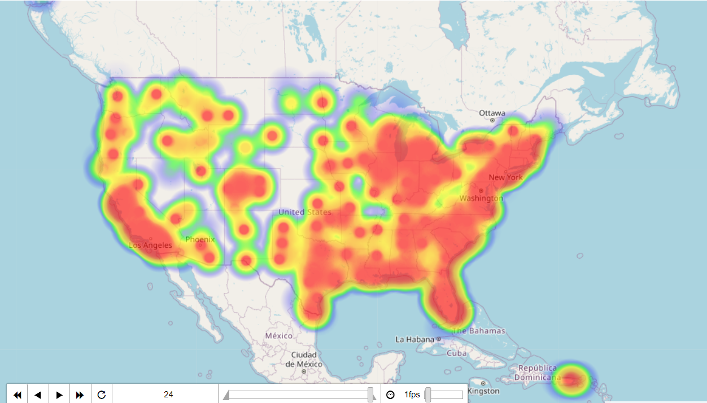
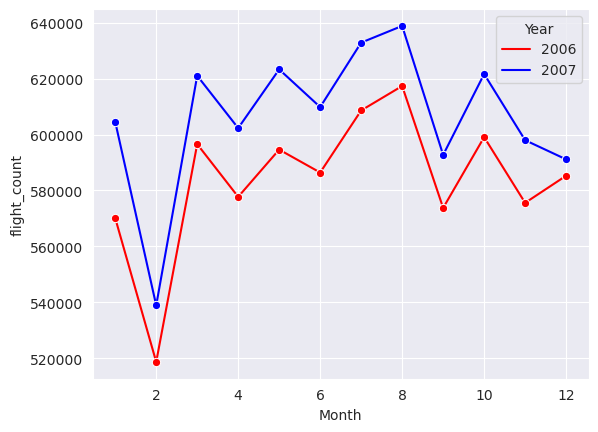
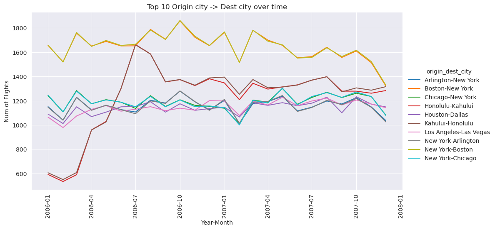
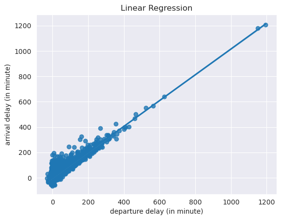
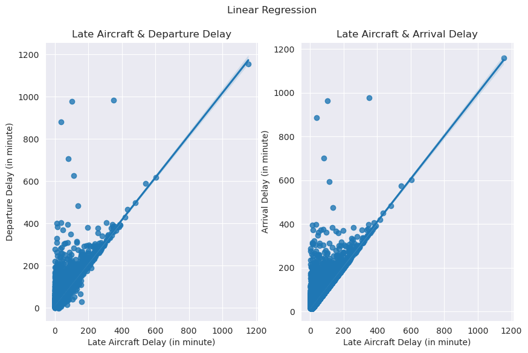

# Airline on Time Data Analysis

### 1. Data Introduce

#### **1.1 Variables Description**

- **Time Period**

​	**Month**:  1 to 12

​	**DayofMonth**: 1 to 31

​	**Dayof Week**: 1 (Monday) - 7 (Sunday)

​	**DepTime**: actual departure time (local, hhmm)

​	**ArrTime**: actual arrival time (local, hhmm)

​	**CRSDepTime**: scheduled departure time (local, hhmm)

​	**CRSArrTime**: scheduled arrival time (local, hhmm)

​	**ArrDelay**: scheduled arrival time - actual arrival time. 

​	**DepDelay**: scheduled departure time - actual departure time.


- **Cause of Delay**

  **CarrierDelay**: in Minutes

  **WeatherDelay**: in Minutes

  **NASDelay**: in Minutes

  **SecurityDelay** : in Minutes

  **LateAircraftDelay**: in Minutes


- **Other Info**

​	**Origin**: origin IATA airport code

​	**Dest**: destination IATA airport code

​	**Distance**: The distance between the Origin and the destination in miles

​	**Cancelled**: whether cancelled? "1 = yes, 0 = no"

​	**CancellationCode**: reason for cancellation (A = carrier, B = weather, C = NAS, D = security)

​	**Diverted**: 1 = yes, 0 = no (to other destination)


---

- `AirTime`, `ArrDelay` and `ArrTime` are `NaN` because the flight was cancelled or diverted

- `DepTime` and `DepDelay` are `NaN` bacause the flight was cancelled

- More than 98% of values in `CancellationCode` are `NaN`, seeing that we don't need to analyse the cancelled flights, so we juest drop the `CancellationCode` columns


### 2. Data Processing

Only very small part of flights were cancelled or diverted, so we can just drop these records and focus on the non-cancelled and non-diverted floghts records.

so the **Flights data from 2006-2007, non-cancelled, non-diverted flights**


#### Q 1. When is the best time of day, day of the week, and time of year to fly to minimise delays?

- There are various factors influencing the minimum delay time, such as airlines, regions, weather, start and end locations, etc. In order to simplify the problem, we will statistics the overall minimum delay time. 
- According to the hours of `CRSDepTime`, group flights into 24 groups, `DepHour` from 0 to 23 : [0, 1), [1, 2) ... [22, 23), [23, 0)

- Delay includes `ArrDelay` and `DepDelay`. the mean of both delays  as the `AvgDelayTime` of the flight.

##### 1. the best time of day



Group flight schedule departure time into 24 hours and plot the average total delay for each grouped time period.  

The average delay time of the flight at `5:00 am` is the smallest, about 1.2 minutes, and then rises all the way until `8:00 pm`. And the average delay time reaches the maximum, around 18 minutes, then the average delay time begins to decrease.


Among them, the delay time at 3:00 a.m. has increased sharply, possibly due to:
1. Fewer staff at the airport and lower efficiency
2. The airport shift change, maintenance at `3.00 pm`
3. Noisy Data Impact

In summary, flight delays are generally lower for morning (`4:00 am` to `10:00 am`) or late night (`0:00 am` to `2:00 am`) flight delays


##### 2. the best day of week



Calculate weekly average delay. 

From the graph we can see that the average flight delay time is lowest on **Saturday**, about 7.1 minutes, following by **Tuesday**, about 7.9 minutes.


##### 3. the best time of year



Calculate monthly average delay. 

**September** is the best month of the year with the lowest average delays, followed by **November**.


#### Q2. How does the number of people flying between different locations change over time?

##### 1. Dynamic Heatmap: Location distribution of the numbers of flight base on month

 [heatmap_with_time.html](README.assets\heatmap_with_time.html) 




The dynamic heat map show the changes of number of flights in different location each month (24 months)

- The distribution of flight airports in the **west coast** and **eastern regions** of the United States is relatively dense, and the flow of flights is relatively large. Especially the flights in **Washington, New York, Los Angeles, and Hawaii** maintain high flow all year round

- The distribution of airports in the west and central regions is relatively sparse, and there are relatively few flights.


##### 2. Lineplot: the number of flights changes over time



The trends in the number of flights each month over the two years are very similar. Compared with 2006, the number of flights in each month of 2007 has increased, meaning that there are more people fly in 2007, and most of people don't like to fly on **February**, and most people fly in **August**


##### 3. Lineplot: Top 10 Aircraft City Routes



A city may have multiple airports, here I have find the top 10 city routes with the highest number of flights, and show their change by line chart. As shown in the line chart:

- **Top 10 flight routes among cities**:

1. **Round-trip routes between New York and Arlington, Boston, Chicago**
2. **Round-trip routes between Honolulu and Kahului, Dallas**
3. **From Los Angeles to Las Vegas**

- The number of round-trip flights between the two cities is similar
- A large number of people commute between **New York and Boston** all year round
- The number of people traveling by plane between **Honolulu and Kahului** increased rapidly from February 2006 to July


#### Q3. Can you detect cascading failures as delays in one airport create delays in others?

##### 1. DepDelay and ArrDelay

To detect the effect of one arriving delayed flight on another delayed flight, we need to prove that **delayed arrival of previous flight causing subsequent flight to take off late, and delayed takeoff will result in delayed arrival, resulting in cascading delays**. i.e. we need to show that **departure delays are strongly correlated with arrival delays**.


- Calculate the **Pearson correlation coefficient** of departure delay and arrival delay to prove the correlation between the both

  **Null hyphothesis**: Departure delay and arrival delay are independent of each other

  Set the significance level at **0.05**

  Running result:

  ```
  Set the significance level at 0.005, null hyphothesis: DepDelay and ArrDelay are independent of each other
  p value: 0.0000
  pearson correlation coefficient:  0.9398918499768079
  Reject null hyphothesis
  ```

It means departure delays are strongly correlated with arrival delays, so one delay flight which causes other to take off late can create delays in others.


- Randomly take 20000 samples, run the linear regression model, we can see that **departure delay and arrival delay are linearly related**: 




##### 2. LateAircraftDelay and DepDelay, ArrDelay

`LateAircraftDelay` is a result of the late arrival of the previous flight that utilized the same plane that will be departing,which causes the current flight to take off late

So, we will talk about the correlation between `LateAircraftDelay` and `DepDelay`, `ArrDelay`, to prove that previous delay can create delays in others

Running result:

```
Set the significance level at 0.005, null hyphothesis: LateAircraftDelay and ArrDelay are independent of each other
p value: 0.0000
pearson correlation coefficient:  0.8013050090098293
Reject null hyphothesis
```

```
Set the significance level at 0.005, null hyphothesis: LateAircraftDelay and DepDelay are independent of each other
p value: 0.0000
pearson correlation coefficient:  0.8257318879775004
Reject null hyphothesis
```




Using same method, through **Pearson correlation coefficient** and **Linear regression**, as the result showing, the pearson corrlation coefficient between `LateAircaftDelay` and `DepDelay`, `ArrDelay` are `0.82` and `0.80` respectively, and results of linear regression show they are linear correlation. **In sum up, previous flight delay can create delays in other, which causes cascading delays.**


#### Q4. Use the available variables to construct a model that predicts delays.

I use the sklearn library to build a model to predict `ArrDelay`

- **Feature selection**

1. Preliminary Selection Features: drop the variables which can calculate the `ArrDelay` directly, like `DepDelay`, `AirrTime`, `ActualElapsedTime` etc. and drop other low relative columns, like `FlightNum`, `TailNum` etc.
2. Calculate the `Pearson correlation coefficient` between `ArrDelay` and the rest of features, then select the features which the correlation coefficient is over `0.1`

```python
# reuslt
['CRSDepTime', 'CRSArrTime','LateAircraftDelay', 'WeatherDelay', 'NASDelay', 'DepHour']
```


- **Generate quadratic polynomials by `PolynomialFeatures`**

  There are too few data features. In order to improve the accuracy of prediction, polynomial features are used


- **Data Split**

  Split data into training set and testing set, testing set ratio is `0.3`

```
shape of X_train and X_test: (9995363, 21) (4283727, 21)
```


- **Model Training and Evaluation**
  - Use `StanderdScaler` to standardize the data set, and make mean of each column of data is 0 and the standard deviation is 1
  - Build`Polynomial regression` models with the `L1` norm, and use `GridSearch` to find the best parameters
  - As a regression prediction problem, `R-Squared` and mean squared error (`MSE`) will be used for evaluating the model


**Finally result:**

- **Polynomial regression:**

  **Train:** 

  R-squared: 0.6495267447874398 

  MSE: 506.57561385776535

  **Test:** 

  R-squared: 0.6492245418404204 

  MSE: 505.37932887907516

- **Polynomial regression with L1:**

  **Train:** 

  R-squared: 0.6492914266850875 

  MSE: 506.91574369756916

  **Test:** 

  R-squared: 0.6489749226559223 

  MSE: 505.73896742562266

  best parameter: {'LA__alpha': 0.05}